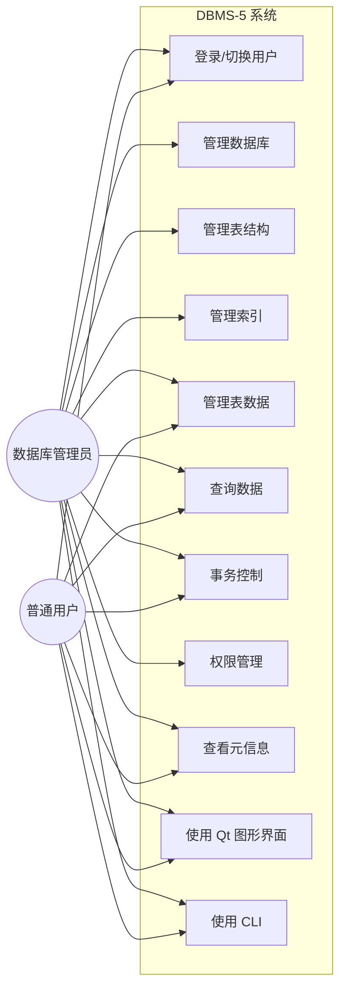

# DBMS-5 需求分析报告

## 1. 需求背景

本项目面向数据库课程综合实践，要求实现一个具有基本 DBMS 能力的软件系统。系统需要支持用户通过 SQL 或图形界面完成数据库、表、数据、索引、事务和权限管理，并通过本地文件持久化数据。

## 2. 用户角色

| 用户 | 特征 | 典型目标 |
|---|---|---|
| 数据库管理员 | 熟悉数据库概念，需要维护库表、权限和数据安全 | 建库建表、授权、备份、查看元信息 |
| 普通用户 | 具备基础 SQL 或 GUI 操作能力 | 查询、插入、更新、删除授权范围内的数据 |
| 开发/测试人员 | 关注系统接口、SQL 行为和稳定性 | 编写测试 SQL、验证错误处理和边界条件 |

## 3. 功能性需求

| 编号 | 需求 | 优先级 | 验收标准 |
|---|---|---|---|
| FR-01 | 用户登录与会话管理 | 高 | root 和普通用户可登录，错误密码拒绝 |
| FR-02 | 数据库管理 | 高 | 可创建、删除、切换和展示数据库 |
| FR-03 | 表结构管理 | 高 | 可创建、删除、修改表和字段 |
| FR-04 | 数据操作 | 高 | 可执行增删改查，并返回受影响行数或结果集 |
| FR-05 | 条件查询 | 高 | WHERE、AND/OR、字段比较可正确过滤 |
| FR-06 | 多表查询 | 中 | 支持多表 FROM、别名和 INNER JOIN |
| FR-07 | 索引管理 | 中 | 可建立、删除、查看索引 |
| FR-08 | 事务管理 | 中 | 支持 BEGIN、COMMIT、ROLLBACK |
| FR-09 | 完整性管理 | 高 | 主键、非空、唯一、默认值、外键检查生效 |
| FR-10 | 权限管理 | 高 | 支持用户创建、授权、回收和权限校验 |
| FR-11 | CLI 交互 | 高 | 可通过 REPL 输入 SQL，支持元命令 |
| FR-12 | Qt 图形界面 | 中 | 可通过 GUI 完成常用查询、数据编辑和管理 |

## 4. 用例图

## 5. 核心业务流程

| 场景 | 流程 |
|---|---|
| 首次使用 | 启动系统 → 使用 root 登录 → 创建数据库 → 创建表 → 插入数据 → 查询验证 |
| 普通查询 | 登录 → USE 数据库 → 输入 SELECT → 执行权限检查 → 返回结果表 |
| 表结构维护 | 登录 root → 选择表 → 修改字段定义 → 提交结构变更 → 刷新目录树 |
| 权限管理 | root 创建用户 → 选择对象 → 勾选权限 → 授权/回收 → 普通用户登录验证 |
| 数据编辑 | 选择表 → 表格中新增/删除/修改行 → 提交保存 → 失败时显示错误原因 |

## 6. 非功能性需求

| 分类 | 需求说明 | 实现方式 |
|---|---|---|
| 可用性 | 系统应提供 CLI 和 GUI 两种入口 | REPL + Qt Widgets |
| 可维护性 | 模块职责清晰，便于定位错误 | Lexer/Parser/Executor/Storage/UI 分层 |
| 可移植性 | 支持 Windows，兼顾 macOS/Linux | C++17、CMake preset、路径与字符串适配 |
| 可靠性 | 数据操作失败时不能破坏文件状态 | 约束检查、事务回滚、WAL 恢复 |
| 安全性 | 普通用户只能访问授权对象 | UserManager + Executor 权限检查 |
| 可测试性 | 关键功能应有自动化测试 | CTest、Qt offscreen 测试、集成测试 |
| 易用性 | GUI 避免要求用户手写复杂 SQL | 表格化建表、树形聚焦、上下文按钮 |
| 性能 | 基础数据规模下响应及时 | B 树索引、表格懒刷新、统一提交 |

## 7. 需求边界

本项目定位为课程实践型轻量 DBMS，重点展示数据库内核核心机制。未作为强制目标的能力包括完整 SQL 标准兼容、大规模并发、多客户端网络服务、复杂查询优化器、存储过程和触发器。

