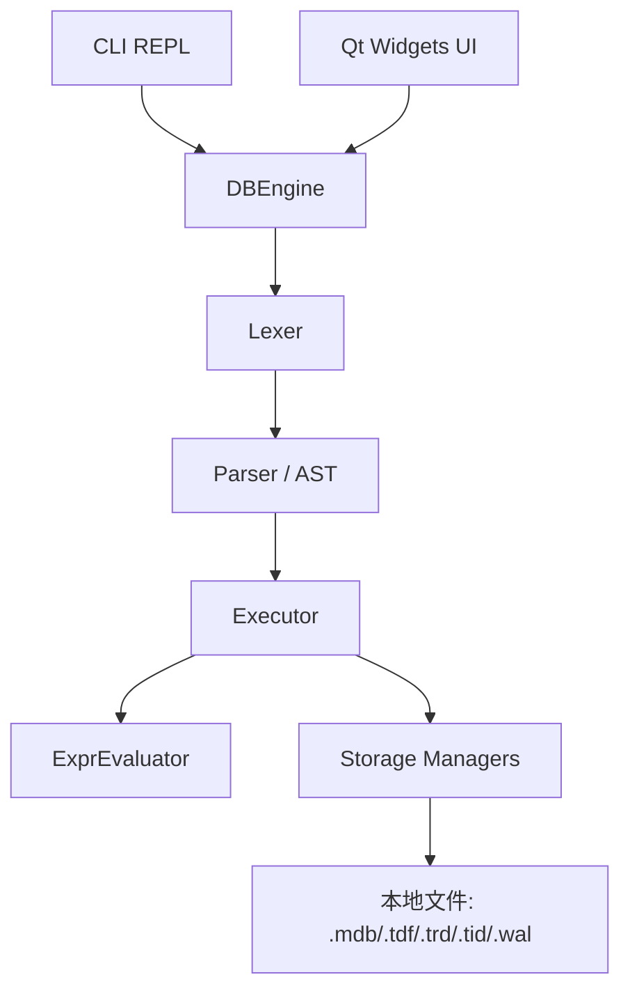
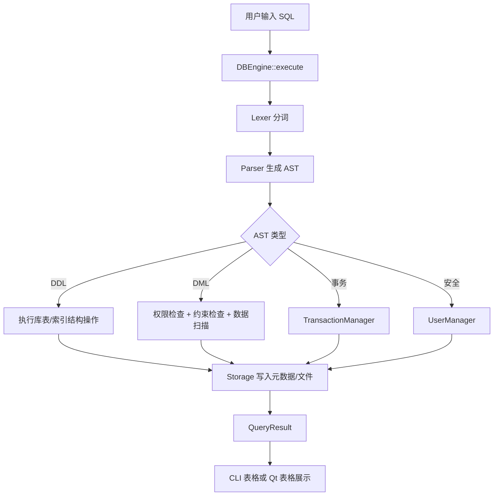
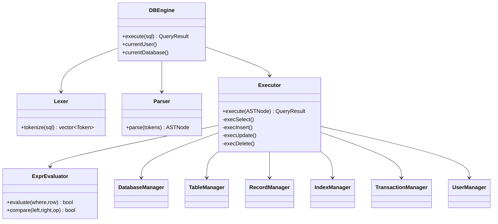
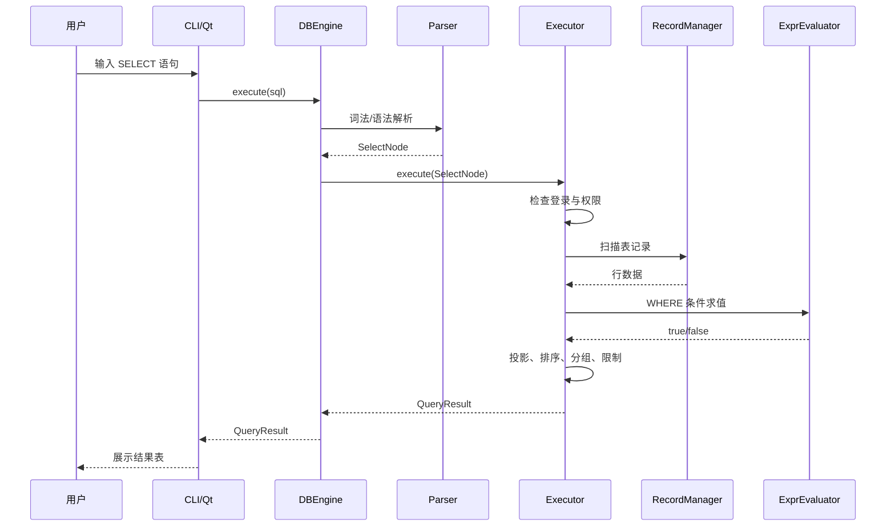
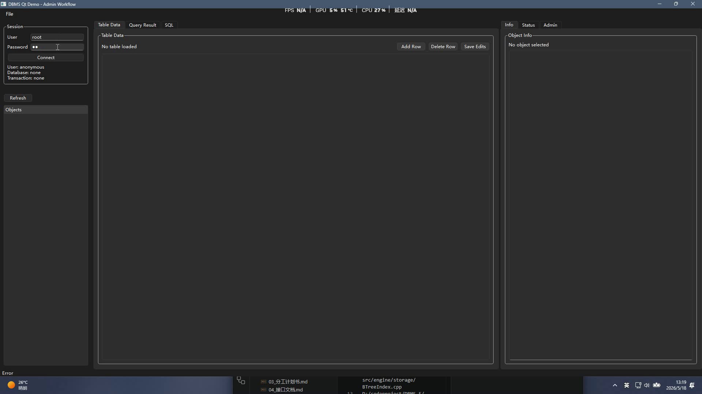
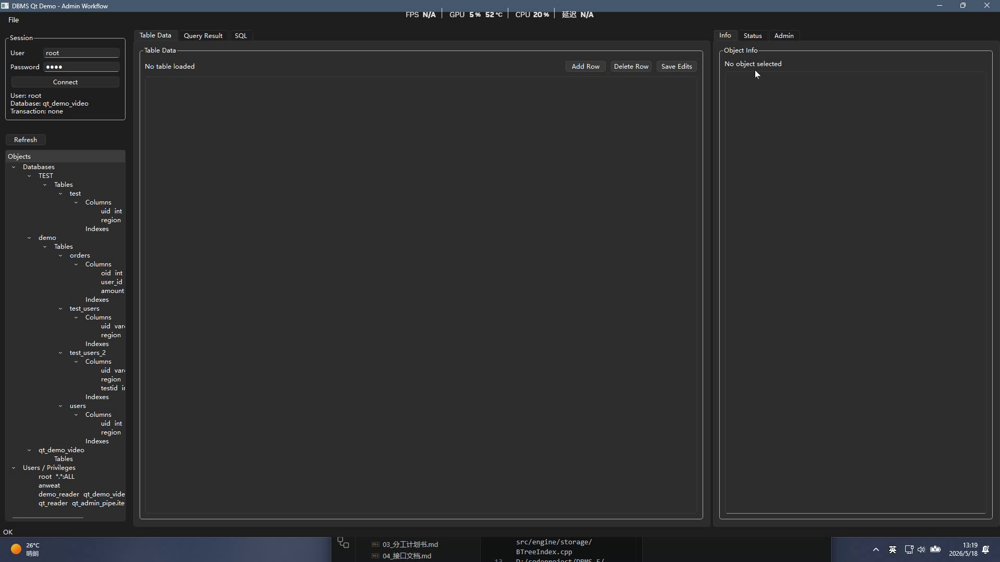

# DBMS-5 设计报告

## 1. 总体架构

系统采用分层架构，用户输入通过 CLI 或 Qt 进入统一的 DBEngine，随后经过解析、执行和存储层完成操作。

## 2. 模块设计

| 模块 | 主要类/文件 | 职责 |
|---|---|---|
| 公共类型 | `src/types.h` | QueryResult、Value、ColumnDef、错误码等共享结构 |
| 引擎入口 | `src/engine/DBEngine.*` | 对外提供 execute 接口，管理会话状态 |
| 词法分析 | `src/engine/lexer/Lexer.*` | 将 SQL 字符串切分为 Token |
| 语法分析 | `src/engine/parser/Parser.*`, `AST.h` | 将 Token 转为 AST 节点 |
| 查询执行 | `src/engine/executor/Executor.*` | 按 AST 类型执行 DDL/DML/权限/事务 |
| 表达式求值 | `ExprEvaluator.*` | WHERE 条件、字段引用、类型比较 |
| 存储管理 | `src/engine/storage/*` | 数据库、表、记录、索引、事务、用户管理 |
| CLI | `src/cli/*` | REPL、元命令、格式化输出 |
| Qt UI | `src/ui/*` | 主窗口、树形目录、SQL 编辑、结果表、Admin 面板 |

## 3. SQL 执行流程图

## 4. 主要类图

## 5. SELECT 查询时序图

## 6. Qt 界面设计

Qt 界面围绕“左侧对象树 + 中央数据/SQL + 右侧上下文管理”组织。

| 区域 | 设计目的 |
|---|---|
| SessionPanel | 登录、当前用户、当前数据库、事务状态 |
| DatabaseTreePanel | 展示数据库、表、列、索引，点击对象时聚焦相关页面 |
| SqlEditorPanel | 输入 SQL、执行、清空、示例和历史 |
| ResultTablePanel | 展示 SELECT 或 SHOW 的结果集 |
| TableEditorPanel | 对当前表进行表格化增删改并统一提交 |
| AdminPanel | 按聚焦对象展示信息、建表、删表、建索引、权限等操作 |

界面样式截图：

## 7. Admin 面板上下文设计

Admin 面板拆分为三个核心页：

| 页面 | 触发对象 | 功能 |
|---|---|---|
| Object | 数据库/表/列/索引 | 展示当前聚焦对象基本信息和可用操作 |
| Structure | 表/列/索引 | 表格化展示字段，支持添加行、删除行、统一提交 |
| Users | 数据库/表 | 展示用户、对象和权限复选框，支持授权/回收 |

这样做的原因是传统 Admin 按钮过多，用户不知道当前操作作用于哪个对象。树形图聚焦后，右侧只展示与当前对象有关的信息和操作，降低误操作。

## 8. 存储文件设计

| 文件类型 | 说明 |
|---|---|
| `.mdb` | 数据库和用户等系统级元信息 |
| `.tdf` | 表结构定义，包括列名、类型、约束 |
| `.trd` | 表记录数据 |
| `.tid` / `.tix` | 索引数据和索引元信息 |
| `.wal` | 写前日志，用于崩溃恢复 |

## 9. 设计小结

系统设计重点是统一入口、分层执行、文件持久化和图形界面上下文操作。CLI 保留数据库系统的直接表达能力，Qt 则把常用管理操作表格化和可视化，二者复用同一个 DBEngine，保证行为一致。

